# Diagrams

## Overview
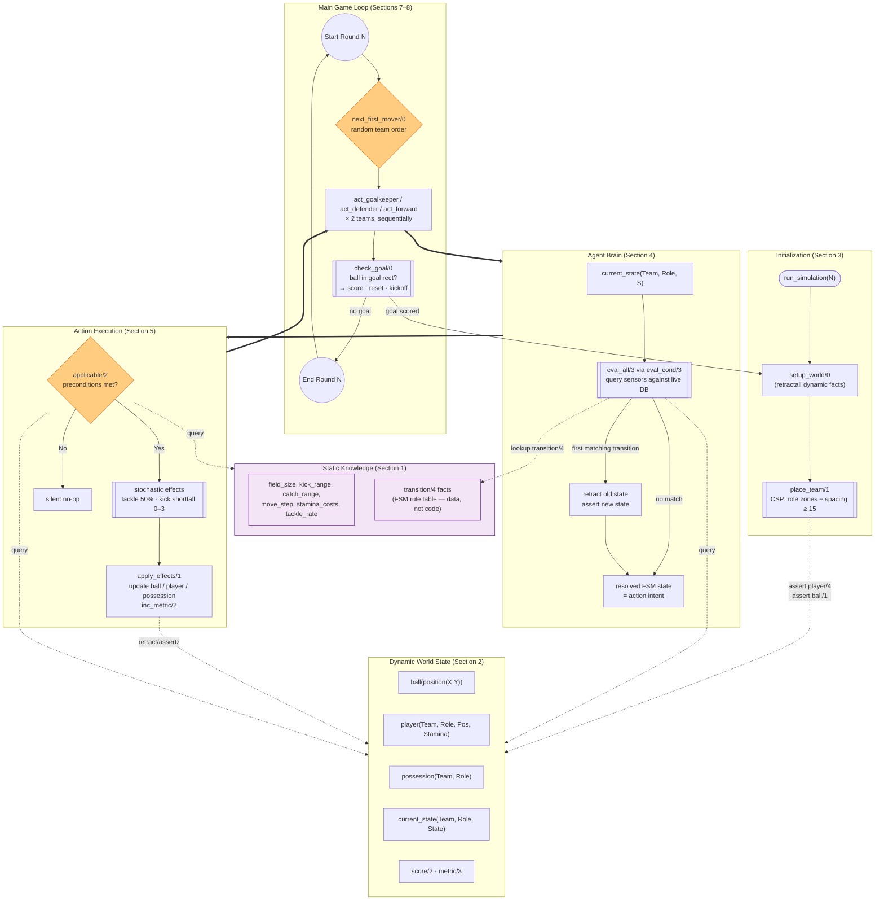

---

## Turn flow

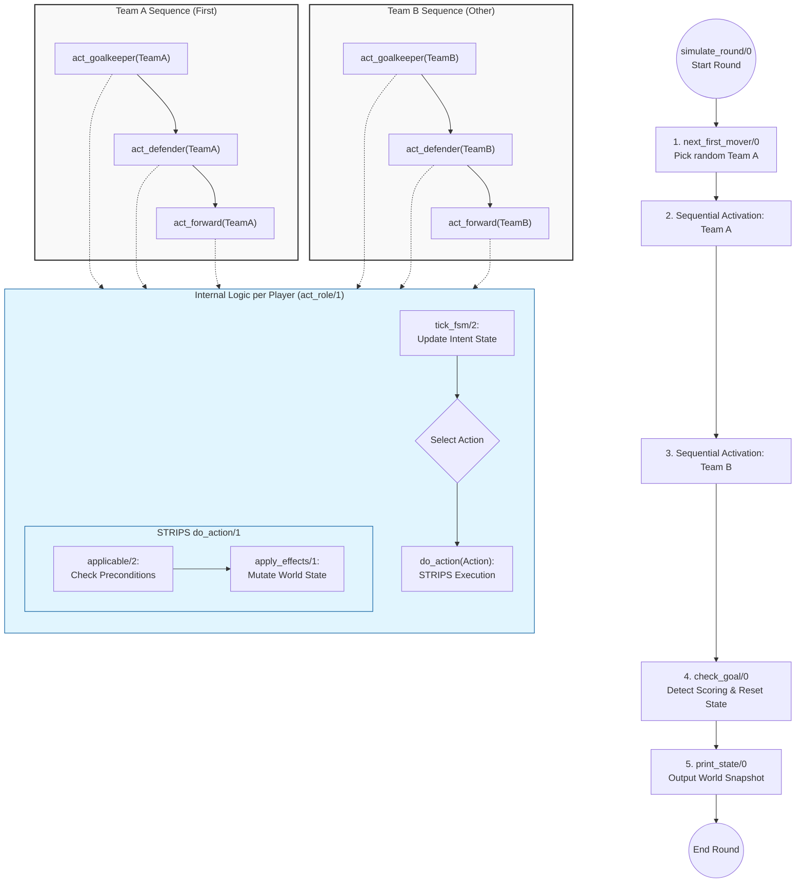

## Player positions

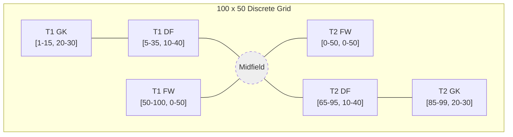

---

## FSM

### Goalkeeper

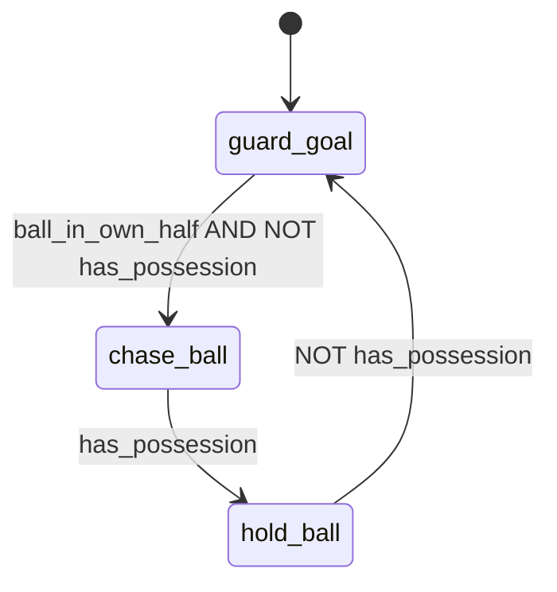

### Defender

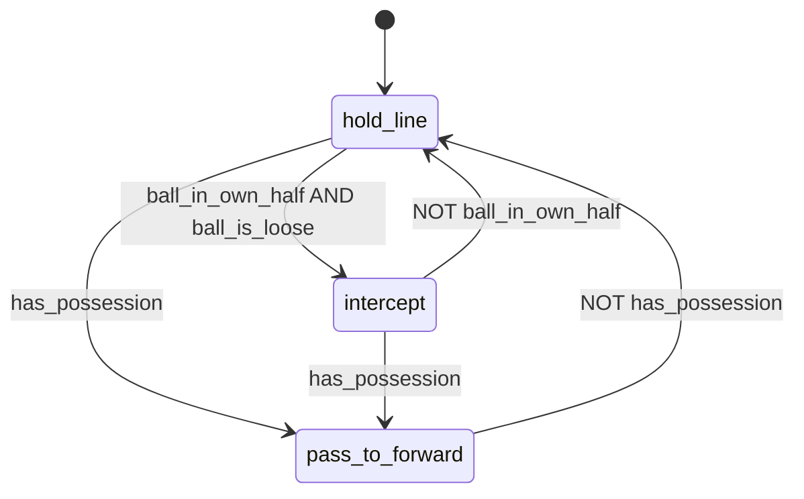

### Forward

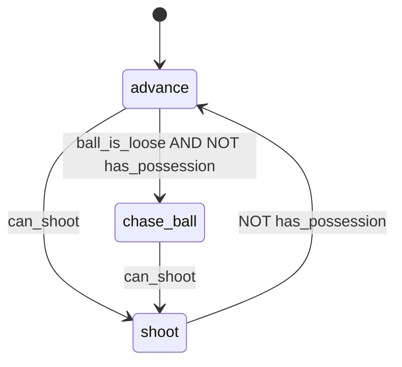

### tick_fsm

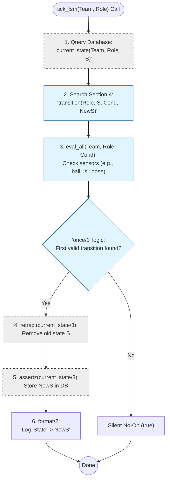

---

## STRIPS

### action schema

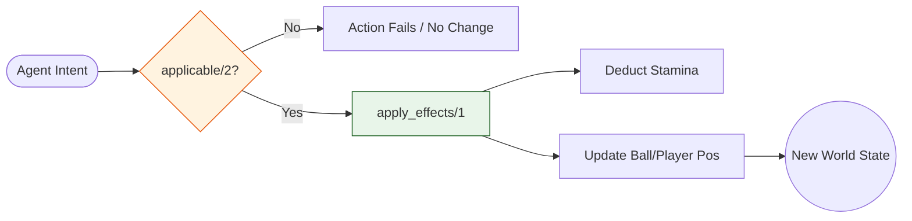

actions:

|**Action**|**Purpose**|**Key Constraints**|
|---|---|---|
|**`move_step`**|Displacement|Moves 5 units; Target must be inside field.|
|**`kick`**|Long-range shot|`kick_range` is 50 units; results in 0–3 unit shortfall.|
|**`catch`**|GK ball recovery|Goalkeeper only; ball must be loose and within 3 units.|
|**`collect`**|Field ball recovery|Non-GK only; ball must be within 1 `move_step` (5 units).|
|**`tackle`**|Stealing ball|50% success rate; tackler must be adjacent to opponent.|
|**`pass`**|Team coordination|Transfers ball directly to a teammate within `kick_range`.|

### GK

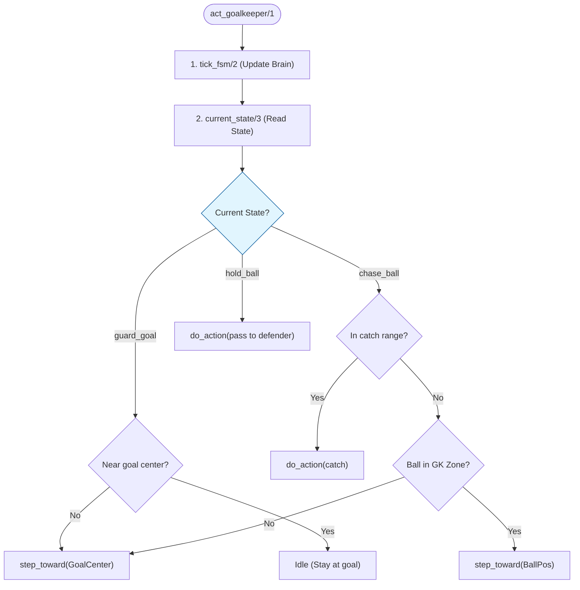

### Defender

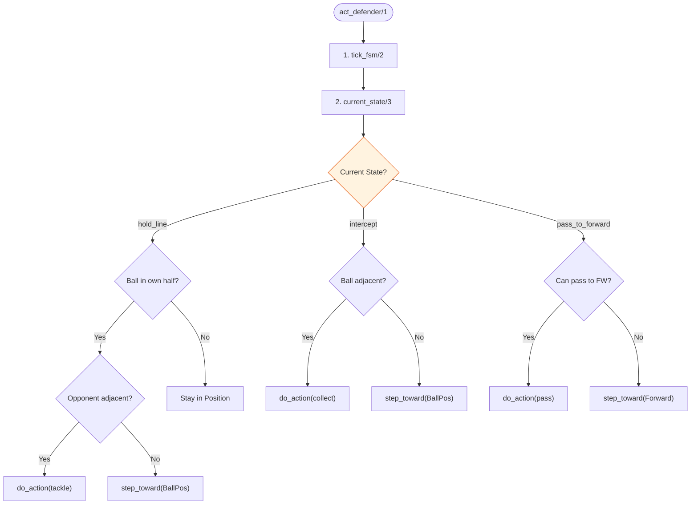

### Forward

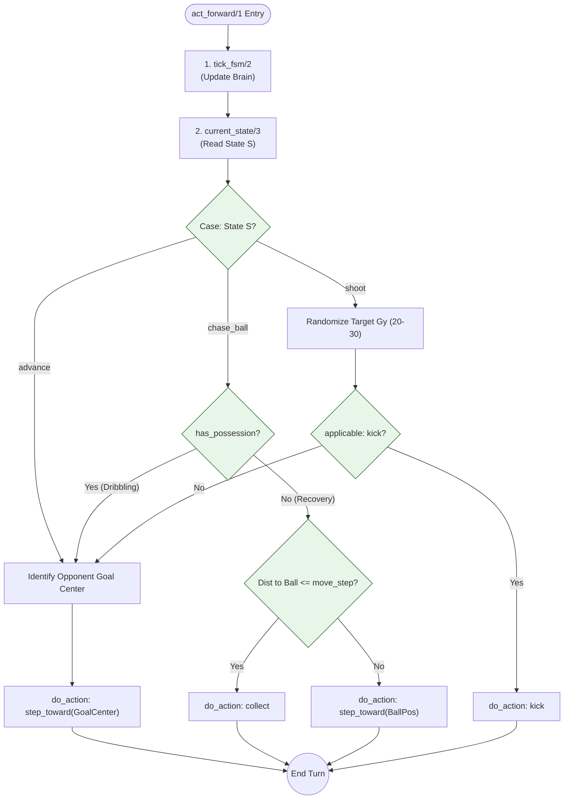

---

## CSP Formation (Section 3)

### place_team constraint network

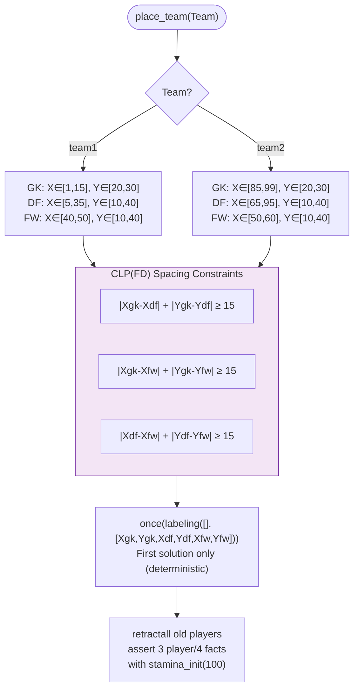

### setup_world initialization sequence

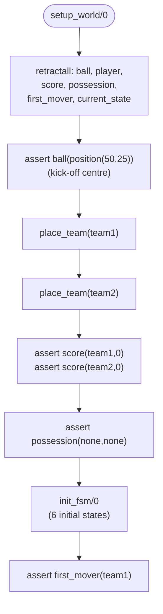

---

## Sensor / Condition Evaluation Pipeline (Section 4)

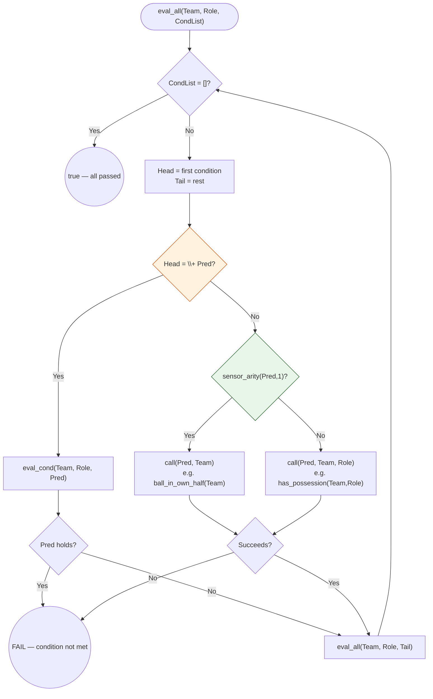

**Sensor arity table:**

| Sensor | Arity | Signature |
|--------|-------|-----------|
| `ball_in_own_half` | 1 | `ball_in_own_half(Team)` |
| `ball_is_loose` | 1 | `ball_is_loose(Team)` (Team ignored) |
| `has_possession` | 2 | `has_possession(Team, Role)` |
| `can_shoot` | 2 | `can_shoot(Team, Role)` |
| `in_catch_range` | 2 | `in_catch_range(Team, Role)` |

---

## Stochastic Outcomes (Section 5)

### Kick shortfall

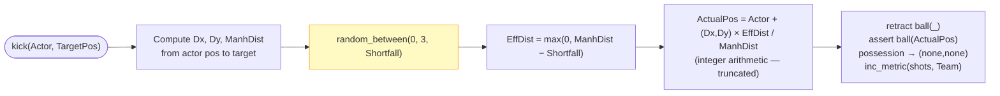

### Tackle probability

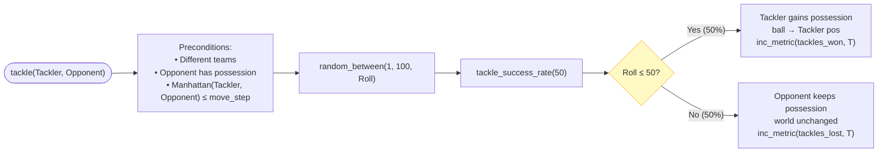

---

## Goal Detection & Reset (Section 7)

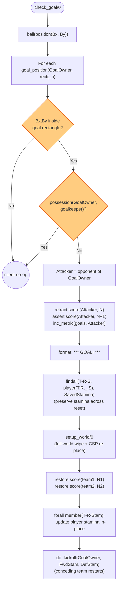

---

## Metrics Tracking (Sections 5 & 7)

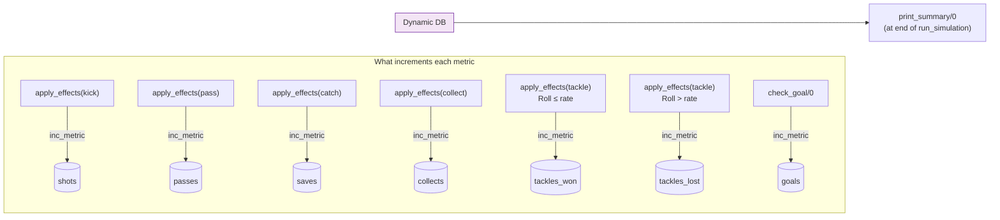

---

## run_simulation Lifecycle (Section 8)

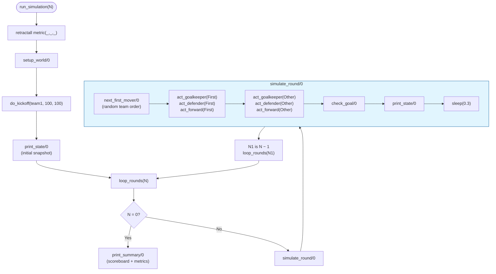
